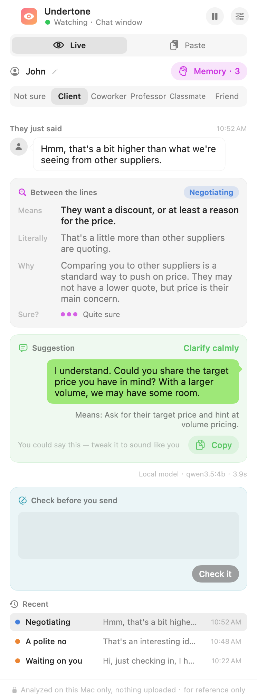
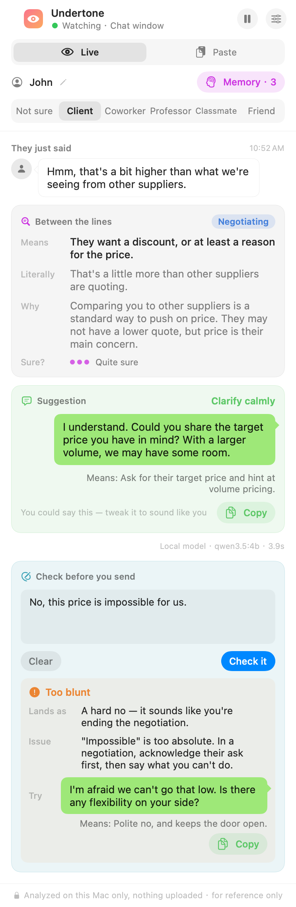
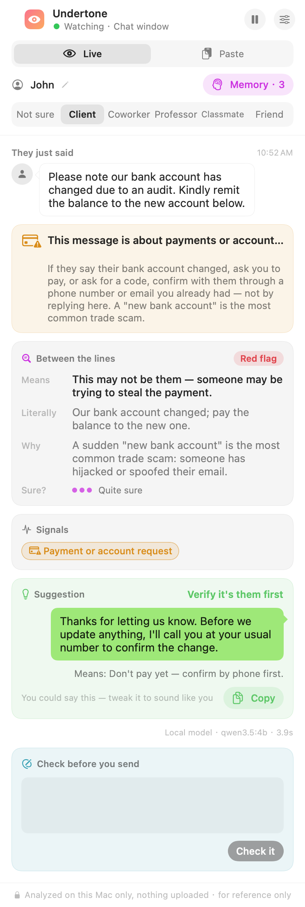

# Undertone

**Reads the subtext in English messages, and explains it in Chinese.**

[中文说明](README.zh-CN.md)

Undertone is a macOS floating panel for Chinese speakers who study, work or trade in English. When a buyer writes *"We'll review it internally and get back to you"*, a manager says *"That's an interesting idea, let's keep it in mind"*, or a professor sends *"Just checking in"*, Undertone tells you:

- **what they actually mean**, in Chinese (still deciding, a polite no, waiting on you…);
- **why** native speakers say it that way in this setting;
- **how sure** it is;
- **a natural English reply**, with its Chinese meaning.

Before you send your own reply, **Check before you send** tells you how your draft will come across (too blunt, too apologetic, too casual, unclear, grammar slips) and offers a more natural version.

<p align="center">
  
  
</p>

Everything runs **on your Mac** by default, with a local Qwen 3.5 4B model through [Ollama](https://ollama.com). No chat leaves the machine unless you choose a cloud model (OpenAI-compatible or Anthropic Claude), and the panel says so the whole time. Undertone only reads the screen. It doesn't hook into any messaging app or send anything, so it can't get your account banned.

## What it reads

The model sorts each English message into one of 11 readings, explains it, and suggests a reply:

| Reading | Example |
|---|---|
| Means what it says | "Sounds good, see you at 3." |
| Just being polite | "We should grab coffee sometime." (no date, not a real invitation) |
| A polite no | "Thanks, but we're all set for now. We'll keep your info on file." |
| Not decided yet | "Let me run this by my manager and circle back." |
| Waiting on you | "Just following up on my email from Monday." |
| Not happy | "Per my last email…", "This is quite disappointing." |
| Genuinely interested | "Can you send three samples? If quality is right, we're looking at 2,000 units." |
| Negotiating | "Another factory quoted us $10.50 for the same spec." |
| Sarcastic | "Oh great, another meeting that could have been an email." |
| Joking | "I'm dead 💀", "this exam is going to kill me" |
| Red flag | "Our bank account has changed due to an audit. Please pay the new account." |

<p align="center"></p>

A keyword safety net catches payment and account scams even when the model misses them. "Our bank account has changed" is the most common fraud in foreign trade, so the panel tells you to confirm through a phone number or email you already had. A second net watches for crisis language and shows support resources.

## How it works

```
chat window ──ScreenCaptureKit──▶ Apple Vision OCR + pixel layout detector ──▶ bubbles: left = them, right = me
     ──▶ new message from them? ──▶ local LLM (cross-cultural prompt, 15 examples) ──▶ keyword safety nets ──▶ panel
```

- **Capture and layout.** ScreenCaptureKit captures only the chat window. A pixel-level detector finds bubbles, avatars, emoji and stickers, so it can tell their messages from yours. Emoji are painted out before OCR, then cropped and named by the vision model.
- **Analysis.** A Chinese system prompt with 15 worked examples covering trade, workplace, campus, friends, hard negatives, a scam and a crisis message, with a JSON answer. The model explains the convention and the real meaning first, and picks the label last.
- **Robust parsing.** Small models often quote English phrases inside JSON strings without escaping them. The parser repairs that instead of failing.
- **Per-contact memory.** Notes such as "first order 5,000 pcs by end of March" are saved only when you confirm.
- **Paste mode** for email, Slack, Teams or anything else you can copy. **Voice messages** can optionally be transcribed with Whisper via [deAPI](https://deapi.ai), only when you tap Listen.

## Quick start

macOS 14 or later, Xcode or the Command Line Tools (Swift 5.10+), and [Ollama](https://ollama.com).

```bash
ollama pull qwen3.5:4b
git clone https://github.com/timothyzhbw-jpg/undertone.git && cd undertone
./scripts/build_app.sh          # builds build/Undertone.app
open build/Undertone.app
```

Allow Undertone under System Settings → Privacy & Security → Screen & System Audio Recording, then select the column of message bubbles in Settings. To try it without a real chat, run the demo chat window, where a fictional buyer negotiates an order:

```bash
swift run UndertoneDemo
```

A one-time local code-signing certificate (Keychain Access → Certificate Assistant → Create a Certificate, named `Undertone Local`, type Code Signing) keeps the screen-recording permission across rebuilds.

## Evaluation

All sets are hand-written English messages with expected readings and must-raise / must-not-raise signals. They are small, so read the numbers as direction, not as a benchmark.

| Set | Size | Prompted qwen3.5:4b (local) |
|---|---|---|
| [`eval/crosscultural.jsonl`](eval/crosscultural.jsonl) (development) | 42 | reading 32/40 (80%), signals 3/3, false alarms 1/18 |
| [`eval/crosscultural.holdout.jsonl`](eval/crosscultural.holdout.jsonl) (held out, not used for tuning) | 29 | reading 19/28 (68%) |
| [`eval/draft.jsonl`](eval/draft.jsonl) (Check before you send) | 26 | verdict 23/26 (88%) |

The drop from 80% to 68% between the development and held-out sets is the honest cost of tuning a prompt against 42 examples. Run the evaluations yourself:

```bash
swift run Undertone --eval eval/crosscultural.jsonl results.jsonl
python3 scripts/score_eval.py eval/crosscultural.jsonl results.jsonl
```

## Fine-tuning a local model

[`train/`](train) holds an overnight experiment: can a small local model learn the task well enough to drop the long few-shot prompt? It uses QLoRA on a 4-bit **Qwen3.5-4B-Base** with [MLX](https://github.com/ml-explore/mlx) on a 24 GB M4 Pro, and compares two ways of labelling a 288-message training pool:

- **Supervised:** gold readings written by hand, with explanations and replies written by the prompted model given the gold answer.
- **Self-training (no human labels):** the prompted model samples each message three times, and only unanimous answers are kept (167 of 288, 87% correct against the gold labels).

| Model | Dev (40) | Held out (28) | Missed / false signals | Time per message |
|---|---|---|---|---|
| Prompted qwen3.5:4b (instruct + 15 examples) | 80% | 68% | 2 / 2 | 5.9 s |
| Base model, short prompt, no fine-tuning | 31% | — | — | 4.1 s |
| LoRA, supervised (255) | 80% | 61% | 3 / 1 | 4.0 s |
| LoRA, self-training only (145) | 70% | 71% | 2 / 2 | 3.7 s |
| **LoRA, supervised + self-training (400)** | **85%** | **68%** | 2 / **0** | **3.9 s** |
| LoRA on 8 layers instead of 5 | 78% | 71% | **1** / **0** | 4.1 s |

Fine-tuning lifts the base model from 31% to the level of the prompted instruct model, with no false alarms, and runs about 35% faster because the long prompt is gone. On 28 held-out items, the differences between the fine-tuned variants are within noise. Details, scripts and the pitfalls hit along the way are in [`train/RESULTS.md`](train/RESULTS.md). One of those pitfalls, a per-token loop when training Qwen3.5's Gated DeltaNet layers, is reported upstream as [ml-explore/mlx-lm#1956](https://github.com/ml-explore/mlx-lm/issues/1956).

## Privacy and limits

- **Local by default.** Messages, memory and screenshots stay on your Mac. Cloud models and deAPI are opt-in, and API keys live only in the Keychain.
- **It's a hint, not a verdict.** In our tests the local 4B model gets roughly a quarter to a third of readings wrong, so check against the actual words and what you know about the person. It isn't legal, financial or business advice.
- Live mode works with chat apps that put their messages on the left and yours on the right. For email or team chat tools, use paste mode.

## Development

```bash
swift build && swift test                  # build, then 130 unit tests (parsing, layout, prompts, safety nets)
swift run Undertone --inspect chat.png     # run recognition on one screenshot
swift run Undertone --render-previews out  # render every panel state with fictional data
```

```
Sources/UndertoneCore/   parsing, layout detection, message tracking, analyzer, draft checker, safety nets
Sources/Undertone/       macOS app: capture, OCR, panel, settings
Sources/UndertoneDemo/   demo chat window
presets/                 prompts, examples and JSON schemas
eval/                    evaluation sets;  train/  fine-tuning experiment
```

## Credits

[Ollama](https://ollama.com), [Qwen](https://github.com/QwenLM), [MLX](https://github.com/ml-explore/mlx), [deAPI](https://deapi.ai). Built with Claude; the chat-bubble parser and new-message tracker were first written with OpenAI Codex.

## License

[Apache License 2.0](LICENSE)
