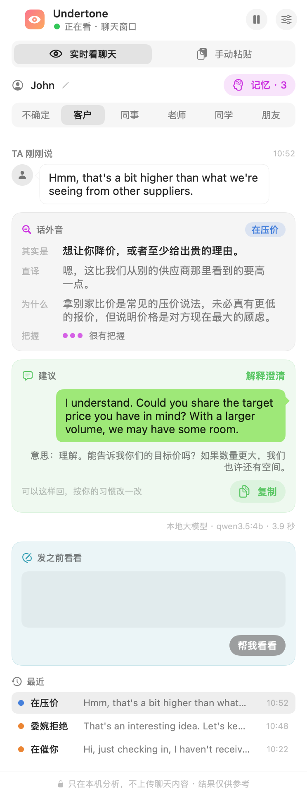
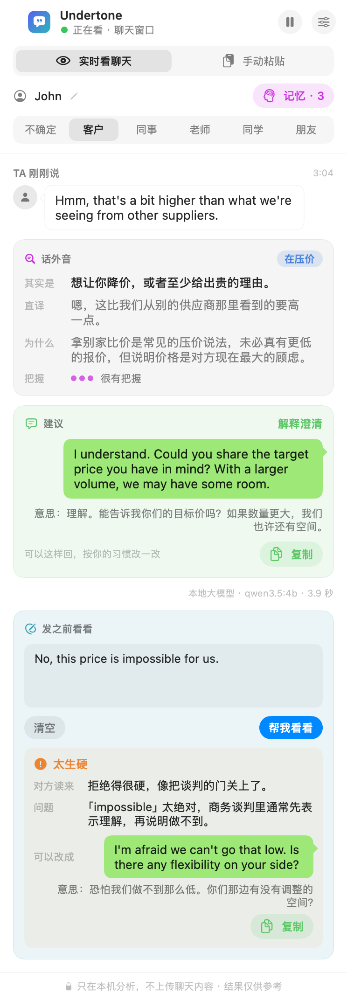
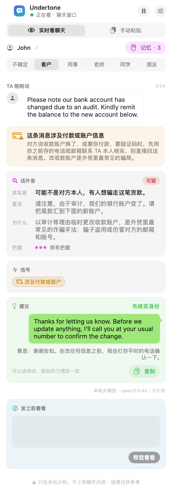

# Undertone

**读懂英文消息里的话外音，用中文（或你的母语）讲给你听。**

**[下载 Mac 版](https://github.com/timothyzhbw-jpg/undertone/releases/latest)** · [English](README.md)

Undertone 是一个 macOS 悬浮面板，给在英语环境里上学、工作、做外贸的中文用户用。解释可以用 13 种语言写：中文、英文、西班牙文、法文、葡萄牙文、德文、俄文、阿拉伯文、印地文、印尼文、日文、韩文、越南文，其他母语的人也能用。客户说 *"We'll review it internally and get back to you"*，上司说 *"That's an interesting idea, let's keep it in mind"*，老师发来一句 *"Just checking in"*，Undertone 会告诉你：

- **对方其实是什么意思**（还没决定、委婉拒绝、在催你……）；
- **为什么**英语母语者在这种场合会这么说；
- **把握有多大**；
- **一句地道的英文回复**，附中文意思。

自己要回消息时，用「**发之前看看**」检查草稿：对方读起来是什么感觉（太生硬、太客气、太随意、意思不清、有语病），再给一个更自然的写法。

<p align="center">
  
  
</p>

默认**全部在你的 Mac 上运行**：本地 Qwen 3.5 4B 模型（通过 [Ollama](https://ollama.com)），不上传任何聊天内容。你也可以换成云端模型（OpenAI 兼容服务或 Anthropic Claude），面板底部会一直提示消息会发给谁。Undertone 只读屏幕，不接入任何聊天软件、也不会替你发消息，所以不会导致封号。

## 能读出哪些话外音

| 类型 | 例子 |
|---|---|
| 字面意思 | "Sounds good, see you at 3." |
| 客套 | "We should grab coffee sometime."（没有具体时间，不算真的约） |
| 委婉拒绝 | "Thanks, but we're all set for now. We'll keep your info on file." |
| 还没决定 | "Let me run this by my manager and circle back." |
| 在催你 | "Just following up on my email from Monday." |
| 不满 | "Per my last email…"、"This is quite disappointing." |
| 有兴趣 | "Can you send three samples? If quality is right, we're looking at 2,000 units." |
| 在压价 | "Another factory quoted us $10.50 for the same spec." |
| 反话 | "Oh great, another meeting that could have been an email." |
| 开玩笑 | "I'm dead 💀"、"this exam is going to kill me" |
| 可疑 | "Our bank account has changed due to an audit. Please pay the new account." |

<p align="center"></p>

**骗局提醒**：说收款账户换了、要你先付费、要验证码，这类消息就算模型没认出来，关键词安全网也会拦下。改收款账户是外贸里最常见的骗局，面板会提醒你先用之前存的电话或邮箱联系对方本人核实。另有一道安全网，遇到轻生信号会给出求助渠道。

## 用起来

**直接下载**：在 [Releases](https://github.com/timothyzhbw-jpg/undertone/releases/latest) 下载 `Undertone-版本号.dmg`，把 Undertone 拖进「应用程序」，再装好 [Ollama](https://ollama.com) 并运行 `ollama pull qwen3.5:4b`。Undertone 没有经过苹果公证，第一次打开会被拦：到 系统设置 → 隐私与安全性，点「仍要打开」；或者运行 `xattr -dr com.apple.quarantine /Applications/Undertone.app`。

**从源码构建**：需要 macOS 14 以上、Xcode 或 Command Line Tools（Swift 5.10+）、[Ollama](https://ollama.com)。

```bash
ollama pull qwen3.5:4b
git clone https://github.com/timothyzhbw-jpg/undertone.git && cd undertone
./scripts/build_app.sh          # 生成 build/Undertone.app
open build/Undertone.app
```

1. 系统设置 → 隐私与安全性 → 屏幕与系统录音，允许 Undertone。
2. 在设置里选中聊天窗口，**只框住消息气泡那一栏**。
3. 在面板上选关系：客户、同事、老师、同学、朋友。同一句英文，对不同的人说意思常常不一样。
4. 解释用哪种语言：设置 → 解释用的语言（默认跟界面语言）。

没有现成的英文聊天，可以先用演示窗口试，里面是一位虚构的外国买家在谈订单：

```bash
swift run UndertoneDemo
```

邮件、团队协作软件里的消息，用「手动粘贴」：复制几条消息粘进来就能分析，不需要屏幕录制权限。手机上的聊天或者邮件，可以直接**粘贴或拖进截图**，在本机识别成文字（你能看到、能改），再接着分析。

建议在「钥匙串访问 → 证书助理 → 创建证书」建一个名为 `Undertone Local` 的代码签名证书，这样重新编译后不用再授权一次。

## 效果怎么样

评测集都是手写的英文消息，标注了期望的话外音类型和必须报、绝不能报的信号。样本很小，数字只说明大方向。

本地 qwen3.5:4b（提示词版本），两列是最早的两种解释语言（其他语言见下文）：

| 评测集 | 条数 | 中文解释 | 英文解释 |
|---|---|---|---|
| 开发集 [`eval/crosscultural.jsonl`](eval/crosscultural.jsonl) | 42 | 话外音类型 34/40（85%） | 38/40（95%） |
| 第一套留出集 [`eval/crosscultural.holdout.jsonl`](eval/crosscultural.holdout.jsonl) | 29 | 22/28（79%） | — |
| 新留出集 [`eval/crosscultural.holdout2.jsonl`](eval/crosscultural.holdout2.jsonl)（调提示词时没用过） | 40 | **32/39（82%）** | **30/39（77%）** |
| 发之前看看 [`eval/draft.jsonl`](eval/draft.jsonl) | 26 | 23/26（88%） | 24/26（92%） |

英文提示词是在新留出集写好之后从中文版翻译过来的，每套只跑了一次，没有对着任何一套调过。开发集调中文提示词时用过，两种语言在上面的分数都偏高；在新留出集上两者只差两条。

### 解释用的语言

其他语言的提示词由 [`scripts/make_language_presets.py`](scripts/make_language_presets.py) 从英文版生成：规则部分保持英文（4B 小模型最听得懂英文指令），示例（读话外音 15 条、发之前看看 7 条）里的解释换成目标语言（[`presets/languages/`](presets/languages)），建议回复和标签每种语言都一样。每种语言在新留出集和「发之前看看」上各跑了一次，走的是同一条代码路径，再用 [`scripts/check_language.py`](scripts/check_language.py) 检查解释是不是真的用了这种语言：

<!-- big-table:start -->
**更大的一轮：每种语言 363 条。** [`train/pool_eval.jsonl`](train/pool_eval.jsonl) 里 324 条人工标注的消息，加上 39 条新留出集，一条只占不到 0.3 个百分点。调中文提示词的规则时用过这 324 条，规则各语言共用，所以绝对数字略偏高；但语言之间的比较是公平的。

| 解释用的语言 | 话外音，363 条 | 95% 区间 | 新留出集（39） | 发之前看看（26） | 解释确实用了这种语言 |
|---|---|---|---|---|---|
| 中文 | **77%** (278/363) | 72–81% | 33/39 | 24/26 | 390/390 |
| 英文 | **77%** (281/363) | 73–81% | 32/39 | 24/26 | 390/390 |
| 西班牙文 | **77%** (278/363) | 72–81% | 29/39 | 20/26 | 390/390 |
| 法文 | **79%** (287/363) | 75–83% | 32/39 | 23/26 | 390/390 |
| 葡萄牙文 | **77%** (281/363) | 73–81% | 26/39 | 21/26 | 390/390 |
| 德文 | **74%** (267/363) | 69–78% | 31/39 | 23/26 | 390/390 |
| 俄文 | **79%** (286/363) | 74–83% | 30/39 | 25/26 | 390/390 |
| 阿拉伯文 | **78%** (282/363) | 73–82% | 33/39 | 23/26 | 390/390 |
| 印地文 | **75%** (274/363) | 71–80% | 27/39 | 22/26 | 388/390 |
| 印尼文 | **77%** (280/363) | 73–81% | 33/39 | 24/26 | 390/390 |
| 日文 | **71%** (257/363) | 66–75% | 27/39 | 24/26 | 390/390 |
| 韩文 | **76%** (275/362) | 71–80% | 29/38 | 21/26 | 389/389 |
| 越南文 | **73%** (264/363) | 68–77% | 30/39 | 23/26 | 386/390 |

区间重叠的语言，在这个样本量下分不出高低。
<!-- big-table:end -->

**第一轮，每种语言 39 条：**

| 解释用的语言 | 话外音（新留出集） | 发之前看看 | 解释确实用了这种语言 |
|---|---|---|---|
| 中文 | 33/39 (85%) | 24/26 (92%) | 66/66 |
| 英文 | 32/39 (82%) | 24/26 (92%) | 66/66 |
| 西班牙文 | 29/39 (74%) | 20/26 (77%) | 66/66 |
| 法文 | 32/39 (82%) | 23/26 (88%) | 66/66 |
| 葡萄牙文 | 26/39 (67%) | 21/26 (81%) | 66/66 |
| 德文 | 31/39 (79%) | 23/26 (88%) | 66/66 |
| 俄文 | 30/39 (77%) | 25/26 (96%) | 66/66 |
| 阿拉伯文 | 33/39 (85%) | 23/26 (88%) | 66/66 |
| 印地文 | 27/39 (69%) | 22/26 (85%) | 66/66 |
| 印尼文 | 33/39 (85%) | 24/26 (92%) | 66/66 |
| 日文 | 27/39 (69%) | 24/26 (92%) | 66/66 |
| 韩文 | 29/38 (76%) | 21/26 (81%) | 65/65 |
| 越南文 | 30/39 (77%) | 23/26 (88%) | 66/66 |

怎么看这张表：

- **在 363 条上，13 种语言里有 11 种落在 74% 到 79% 之间**，区间互相重叠。日文（71%）和越南文（73%）最低；只有日文的区间勉强够到第一梯队，它大概确实弱一点。39 条时的大起伏多半是噪声：葡萄牙文从 67% 变成 77%，西班牙文从 74% 变成 77%。
- **39 条时，同一个模型、同一套提示词，两次运行会差一两条。** 中文和英文的话外音是本节第一张评测表的第二次运行，分别变了一条和两条（32 → 33、30 → 32）。39 条里一条就是 2.6 个百分点，所以语言之间的差距大多是噪声。这次葡萄牙文、印地文、日文最低。「发之前看看」这一列是在改了一条示例之后跑的：那条示例的改写里原本带着价格，模型会把「$3.50」抄进不相干的回复；西班牙文改之前 23/26，改之后 20/26。
- **模型几乎总是用要求的语言回答。** 在更大的一轮里，324 条越南文解释中有 4 条句子里夹了几个汉字（Qwen 的训练数据里中文很多），2 条印地文解释混进了别的文字的字母。韩文有一条输出解析失败。
- **示例的译文是机器写的，没有母语者校对过。** 小语种请当作第一版，欢迎修改 `presets/languages/*.json`。
- **没有为任何语言做微调。** 在新消息上，提示词版本比我们微调的模型好（见下文），所以新语言都靠提示词加。

自己跑一种：`UNDERTONE_EXPLAIN=es swift run Undertone --eval eval/crosscultural.holdout2.jsonl results.jsonl`，再 `python3 scripts/check_language.py results.jsonl es`。

提示词最近一次是对着 [`train/pool.jsonl`](train/pool.jsonl) 里 324 条人工标注的消息调的：把一条笼统的「别过度解读」换成按顺序判断的清单以后，那 324 条从 67% 提到 75%，客套话、委婉拒绝被当成字面意思的情况少了很多。但在新留出集上只从 79% 到 82%，所以更大的那部分提升里，有一些是模型学会了我的标注习惯。本地 4B 模型大约每三到五条会看错一条，请对照原话和你对这个人的了解来判断，它给的只是参考。

## 本地模型训练

[`train/`](train) 里是一晚上的实验：用 MLX 在 24GB 的 M4 Pro 上对 4 bit 的 Qwen3.5-4B-Base 做 QLoRA 微调，比较两种给训练数据打标签的办法：

- **有监督**：288 条训练消息的话外音类型由人工标注，解释和回复让提示词模型照着标准答案写。
- **无监督（自训练）**：不用人工标签。让提示词模型对每条采样 3 次，只留 3 次结论都一样的那些（167 条，对照人工标签有 87% 是对的）。

| 模型 | 开发集 | 留出集 | 每条耗时 |
|---|---|---|---|
| 提示词版本（指令模型 + 15 条示例） | 80% | 68% | 5.9 秒 |
| 没微调的 Base 模型 | 31% | — | 4.1 秒 |
| 有监督 | 80% | 61% | 4.0 秒 |
| 只用自训练 | 70% | 71% | 3.7 秒 |
| **有监督 + 自训练** | **85%** | **68%** | **3.9 秒** |

微调把 Base 模型从 31% 提到了接近提示词版本的水平，而且快了约三成。**但在之后新写的一套留出集上，提示词版本明显更好**：79% 对 62–66%，微调模型还漏掉了更多骗局和轻生信号。几百条手写的训练数据，泛化能力比不上一个好的指令模型加好示例。所以应用默认用提示词版本，微调模型只作为实验性的「快速」模式（[怎么构建](train/ollama/README.md)）。过程、脚本和踩过的坑见 [`train/RESULTS.md`](train/RESULTS.md)。

## 隐私

- 默认全部在本机：消息、联系人记忆、截图都不离开你的 Mac。云端模型和 deAPI 语音转写需要你自己打开，API Key 只存在钥匙串里。
- 日志里的聊天内容一律标成隐私，不会以明文出现。
- 实时模式适用于对方消息在左、自己在右的聊天界面；其他场景用手动粘贴。

## 许可证

[Apache License 2.0](LICENSE)
